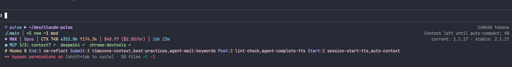

# claude-pulse

A customizable, real-time statusline for [Claude Code](https://docs.anthropic.com/en/docs/claude-code).

See your tokens, cost, context usage, MCP servers, git status, and hooks — all at a glance while you work.



## Quick Start

### 1. Install

```bash
npm install -g claude-pulse
```

Or install from source:

```bash
git clone https://github.com/ali-nr/claude-pulse.git
cd claude-pulse
bun install
bun run build
```

### 2. Configure Claude Code

Add to your Claude Code settings (`~/.claude/settings.json`):

```json
{
  "statusLine": {
    "type": "command",
    "command": "claude-pulse"
  }
}
```

If installed from source, use the full path: `"command": "node /path/to/claude-pulse/dist/cli.js"`

### 3. Done

Restart Claude Code. You'll see the statusline appear above the input area.

## What Each Section Shows

```
♥ pulse ▶ ~/dev/my-project          ← Line 1: Project identity
⎇ main │ +3 new ~5 mod              ← Line 2: Git branch + file changes
◆ MAX │ Opus │ CTX 42% ... │ $2.37  ← Line 3: Subscription, model, tokens, cost, duration
⬢ MCP 3/3: context7 ✓ ...          ← Line 4: MCP server connections
⚡Hooks 4 Submit:2 ...              ← Line 5: Active hooks by event type
```

### Token Display

| Symbol | Meaning |
|--------|---------|
| `CTX 42%` | Context window usage (how full Claude's memory is) |
| `↓85.0k` | Input tokens — everything sent to Claude (your messages, files, tool results) |
| `↑15.0k` | Output tokens — everything Claude has written back |
| `⟳45.0k` | Cache reads — tokens served from cache (saves cost) |

### MCP Server Status

| Icon | Meaning |
|------|---------|
| `✓` | Connected and working |
| `✗` | Disconnected |
| `○` | Disabled (detected from `~/.claude.json`) |
| `▲` | Error |

### Cost Display

- Green: under $1
- Yellow: $1–$2
- Peach: $2–$5
- Red: over $5
- Burn rate `($X.XX/hr)` shown when session is longer than 1 minute

## Customization

Create `~/.config/claude-pulse/config.json` to customize everything. You only need to include the options you want to change — everything else uses sensible defaults.

### Layout

The statusline has 5 fixed lines, each with a purpose:

| Line | Key | Components |
|------|-----|------------|
| 1 — Identity | — | `♥ pulse ▶ ~/path` (fixed) |
| 2 — Git | `git` | `branch`, `status` |
| 3 — Engine | `engine` | `tier`, `model`, `context`, `cost`, `session` |
| 4 — MCP | `mcp` | `mcp` |
| 5 — Hooks | `hooks` | `hooks` |

Line 1 is the claude-pulse brand line and is not configurable. Hide or adjust the other lines:

```json
{
  "lines": {
    "hooks": { "enabled": false },
    "engine": { "separator": " | " }
  }
}
```

The line structure is fixed — you customize the components within each line, not the layout itself.

### Subscription Tier

The tier badge auto-detects from your Claude account (`~/.claude.json`). If detection doesn't work for your setup, override it:

```json
{
  "components": {
    "tier": {
      "enabled": true,
      "override": "max",
      "labels": { "pro": "◆ PRO", "max": "◆ MAX", "api": "◆ API" }
    }
  }
}
```

Set `"override"` to `"pro"`, `"max"`, or `"api"`. Customize labels to any text you want.

### Context Window

Five display styles available:

| Style | Example | Best For |
|-------|---------|----------|
| `compact` | `42%` | Minimal |
| `bar` | `●●●●○○○○○○ 42%` | Visual |
| `detailed` | `84.0k/200.0k (42%)` | Token-aware |
| `both` | `●●●●○○○○○○ used:84.0k free:116.0k` | Everything |

```json
{
  "components": {
    "context": {
      "style": "compact",
      "showTokens": true,
      "showRate": false,
      "showCompactHint": false,
      "thresholds": { "warn": 70, "critical": 85, "danger": 95 }
    }
  }
}
```

- `showTokens` — show `↓input ↑output ⟳cache` breakdown
- `showRate` — show tokens/min consumption rate
- `showCompactHint` — suggest `/compact` when context is high
- `thresholds` — customize when colors change (yellow/orange/red)

### MCP Servers

Control how much detail you see:

```json
{
  "components": {
    "mcp": {
      "showNames": true,
      "showOnlyProblems": false,
      "maxDisplay": 4,
      "label": "⬢ MCP",
      "icons": { "connected": "✓", "disconnected": "✗", "disabled": "○", "error": "▲" }
    }
  }
}
```

| Option | What It Does |
|--------|-------------|
| `showNames: true` | `⬢ MCP 3/3: context7 ✓  deepwiki ✓  chrome ✓` |
| `showNames: false` | `⬢ MCP 3/3` |
| `showOnlyProblems: true` | Hides MCP line entirely when all servers are healthy |
| `maxDisplay: 2` | Shows first 2 servers + `+1 more` |

Failed/disconnected servers always show in red regardless of settings.

### Hooks

Control the verbosity of hook display:

```json
{
  "components": {
    "hooks": {
      "showNames": true,
      "showCount": true,
      "label": "Hooks"
    }
  }
}
```

| Setting | Result |
|---------|--------|
| Both `true` (default) | `⚡Hooks 8 Submit:3 timezone-context,best-practices Post:2 lint-check` |
| `showNames: false` | `⚡Hooks 8 Submit:3 Post:2 Start:2 End:1` |
| Both `false` | `⚡Hooks 8` |

Broken hooks (invalid file paths) always show in red with `▲` regardless of settings.

### Cost

```json
{
  "components": {
    "cost": {
      "showBurnRate": true,
      "showProjection": false,
      "label": "$"
    }
  }
}
```

Cost colors automatically: green < $1, yellow $1–$2, peach $2–$5, red > $5. Burn rate `($X.XX/hr)` appears after the session is longer than 1 minute.

### Other Components

| Component | Key Options |
|-----------|-------------|
| `model` | `showIcon: true` adds emoji (🧠 Opus, 🎵 Sonnet, ⚡ Haiku) |
| `branch` | `label: "⎇"` sets a prefix before the branch name |
| `session` | `showDuration: true`, `showId: false` |
| `cache` | `label: "Cache"` — shows cache hit rate percentage |
| `linesChanged` | Shows `+added -removed` lines changed by Claude |
| `time` | `format: "12h"` or `"24h"`, `showTimezone: true` |

All components accept `"enabled": false` to hide them.

## Example Configs

### Minimal — hide what you don't need

```json
{
  "lines": {
    "hooks": { "enabled": false }
  },
  "components": {
    "status": { "enabled": false },
    "mcp": { "showOnlyProblems": true },
    "context": { "style": "compact" },
    "cost": { "showBurnRate": true }
  }
}
```

### Full detail — everything visible

```json
{
  "components": {
    "tier": { "enabled": true, "override": "max" },
    "context": { "style": "compact", "showTokens": true },
    "cost": { "showBurnRate": true },
    "mcp": { "showNames": true, "showOnlyProblems": false },
    "hooks": { "showNames": true }
  }
}
```

### Quiet — problems only

```json
{
  "components": {
    "context": { "style": "compact" },
    "mcp": { "showNames": true, "showOnlyProblems": true },
    "hooks": { "showNames": false, "showCount": false }
  }
}
```

MCP line only appears when a server has problems. Hooks show just the total count.

## How It Works

Claude Code invokes the statusline script on every message update (throttled to ~300ms). The script receives session data as JSON on stdin, renders the configured components with ANSI colors, and outputs the result to stdout.

- Stateless — each invocation is independent
- Fast — renders in under 50ms
- No network calls — all data comes from stdin or local files
- Catppuccin Mocha theme with 24-bit color

## Development

```bash
bun install          # Install dependencies
bun run build        # Build to dist/
bun run lint         # Run Biome linter
bun run dev          # Watch mode

# Test with sample data
echo '{"hook_event_name":"Status",...}' | bun run src/cli.ts
```

## License

MIT
