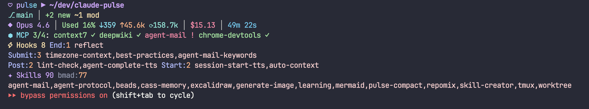
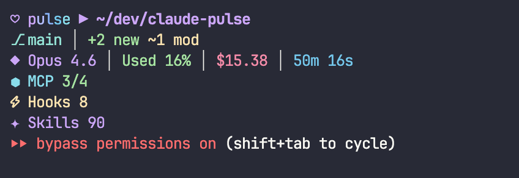

# cc-pulse

[](https://www.npmjs.com/package/cc-pulse)
[](LICENSE)

A real-time statusline for [Claude Code](https://docs.anthropic.com/en/docs/claude-code).

**Full mode** shows names, groups, and token breakdown:



**Compact mode** shows counts only:



## Quick Start

```bash
npm install -g cc-pulse
```

Add to `~/.claude/settings.json`:

```json
{
  "statusLine": {
    "type": "command",
    "command": "cc-pulse"
  }
}
```

Restart Claude Code and the statusline appears below the input area.

## Features

| Feature | Description |
|---------|-------------|
| **Context usage** | Percentage used, colour shifts from green to red as you approach limits |
| **Token breakdown** | Input, output, and cache tokens at a glance |
| **Model info** | Model family and version, e.g. "Opus 4.6" |
| **Cost tracking** | Session cost with colour coding |
| **MCP health** | Live connection status for all MCP servers |
| **Hook monitoring** | Active hooks by event type with broken path detection |
| **Skills display** | Adapts automatically: individual names, prefix grouping, or counts only |
| **Git status** | Branch name and file change counts |
| **Responsive layout** | Width-aware wrapping and a compact mode for smaller screens |

## What You Get

| Line | Content |
|------|---------|
| **Identity** | Project name and working directory |
| **Git** | Branch and file changes (new, modified, deleted) |
| **Engine** | Model, context usage, tokens, cost, session duration |
| **MCP** | Server count and individual status |
| **Hooks** | Hook count by event type with broken path warnings |
| **Skills** | Names when few, prefix groups when many |

## Responsive Display

The statusline adapts to your setup automatically.

**Skills** adapt based on count:
- 10 or fewer: lists all names, e.g. `✦ Skills 5 beads,excalidraw,mermaid,tmux,repomix`
- More than 10 with shared prefixes: groups them, e.g. `✦ Skills 89 bmad:77 beads,excalidraw,...`
- More than 10 without groups: caps at 10 names with overflow, e.g. `✦ Skills 15 a,b,c,... +5`

**Hooks** adapt based on total count:
- 6 or fewer: shows all names per event, e.g. `⚡Hooks 4 Submit:2 lint,format Post:2 test,deploy`
- More than 6: caps names to 3 per group, e.g. `⚡Hooks 12 Submit:5 lint,format,check +2`

**Width-aware wrapping** breaks long lines at component boundaries instead of cutting them off.

**Compact mode** collapses everything to counts only. Toggle with `/pulse-compact` or set in config:
```json
{
  "compact": true
}
```

## Configuration

Create `~/.config/claude-pulse/config.json` to customise. Only include what you want to change.

<details>
<summary><strong>Compact Mode</strong></summary>

Minimal display with counts and essential info only. Toggle with `/pulse-compact` or set manually:

```json
{
  "compact": true
}
```

Skills, hooks, and MCP show counts only. Context hides the token breakdown. Cost hides burn rate. CWD shortens.

</details>

<details>
<summary><strong>Context Window</strong></summary>

Shows how much of the context window is used. Colours shift as usage increases.

```json
{
  "components": {
    "context": {
      "style": "bar",
      "showTokens": true,
      "thresholds": { "warn": 70, "critical": 85, "danger": 95 }
    }
  }
}
```

| Style | Example |
|-------|---------|
| `bar` | `Used ●●●●●●○○○○ 58%` |
| `percent` (default) | `Used 58%` |
| `detailed` | `Used 116.0k/200.0k (58%)` |
| `both` | `●●●●●●○○○○ 116.0k / 200.0k` |

Colour thresholds: green below 70%, yellow at 70%, orange at 85%, red at 95%.

</details>

<details>
<summary><strong>MCP Servers</strong></summary>

```json
{
  "components": {
    "mcp": {
      "showNames": true,
      "showOnlyProblems": false,
      "maxDisplay": 4
    }
  }
}
```

| Option | Effect |
|--------|--------|
| `showNames: true` | List each server with its status |
| `showOnlyProblems: true` | Hide the line when all servers are healthy |
| `maxDisplay: 4` | Limit servers shown, with "+N more" for the rest |

| Icon | Status |
|------|--------|
| ✓ | Connected |
| ✗ | Disconnected |
| ○ | Disabled |
| ▲ | Error |

</details>

<details>
<summary><strong>Hooks</strong></summary>

```json
{
  "components": {
    "hooks": {
      "showNames": true,
      "showCount": true
    }
  }
}
```

| Setting | Result |
|---------|--------|
| Both `true` | `⚡Hooks 8 Submit:3 timezone-context,best-practices` |
| `showNames: false` | `⚡Hooks 8 Submit:3 Post:2 End:1` |
| Both `false` | `⚡Hooks 8` |

With more than 6 hooks, names are capped to 3 per event group with a `+N` overflow count.

Broken hooks (invalid paths) show in red with ▲.

</details>

<details>
<summary><strong>Cost</strong></summary>

```json
{
  "components": {
    "cost": {
      "showBurnRate": true,
      "label": "$"
    }
  }
}
```

Colour thresholds: green below $1, yellow $1 to $2, orange $2 to $5, red above $5.

</details>

<details>
<summary><strong>Skills</strong></summary>

Shows your custom slash commands from `~/.claude/skills/` and `.claude/skills/`.

```json
{
  "components": {
    "skills": {
      "showNames": true,
      "showCount": true,
      "maxDisplay": 5
    }
  }
}
```

The display adapts automatically based on how many skills you have. See [Responsive Display](#responsive-display) above.

Broken skills (missing SKILL.md or invalid frontmatter) show in red with ▲.

</details>

<details>
<summary><strong>CWD (Working Directory)</strong></summary>

Control how the current directory is displayed:

```json
{
  "components": {
    "cwd": {
      "style": "short",
      "maxLength": 30,
      "showIcon": true
    }
  }
}
```

| Style | Example |
|-------|---------|
| `short` (default) | `~/…/fix-1612` |
| `full` | `/home/user/.worktree/my-project/2026-02-13/fix-1612` |
| `basename` | `fix-1612` |
| `project` | Project folder name |

Increase `maxLength` to show more of the path, or use `basename` if you only care about the folder name.

</details>

<details>
<summary><strong>Dividers</strong></summary>

Add horizontal line separators between status sections:

```json
{
  "dividers": true
}
```

Off by default.

</details>

<details>
<summary><strong>Layout</strong></summary>

The 6-line structure is fixed. You can toggle lines and change separators:

```json
{
  "lines": {
    "hooks": { "enabled": false },
    "engine": { "separator": " | " }
  }
}
```

| Line | Key | Toggleable |
|------|-----|------------|
| Identity | n/a | No |
| Git | `git` | Yes |
| Engine | `engine` | Yes |
| MCP | `mcp` | Yes |
| Hooks | `hooks` | Yes |
| Skills | `skills` | Yes |

</details>

<details>
<summary><strong>All Components</strong></summary>

| Component | Key Options |
|-----------|-------------|
| `model` | `showIcon: true` (default), custom `icons: { opus, sonnet, haiku }` |
| `session` | `showDuration: true`, `showId: false` |
| `cache` | Shows cache hit rate |
| `linesChanged` | Shows `+added -removed` |
| `time` | `format: "12h"/"24h"`, `showTimezone: true` |

All components accept `"enabled": false` to hide them.

</details>

## Slash Commands

cc-pulse ships with a skill you can install to your Claude Code skills directory:

| Command | Description |
|---------|-------------|
| `/pulse-compact` | Toggle compact mode on/off |

Copy `skills/pulse-compact/` to `~/.claude/skills/` or your project's `.claude/skills/`.

## Development

```bash
git clone https://github.com/ali-nr/claude-pulse.git
cd claude-pulse
bun install
bun run build
bun test
```

For local testing, use the full path in settings: `"command": "node /path/to/claude-pulse/dist/cli.js"`

## License

MIT
