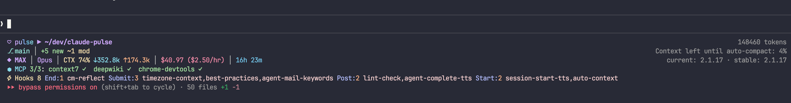

# cc-pulse

[](https://www.npmjs.com/package/cc-pulse)
[](LICENSE)

A real-time statusline for [Claude Code](https://docs.anthropic.com/en/docs/claude-code).



## Quick Start

```bash
npm install -g cc-pulse
```

Add to `~/.claude/settings.json`:

```json
{
  "statusLine": {
    "type": "command",
    "command": "cc-pulse"
  }
}
```

Restart Claude Code — the statusline appears below the input area.

## Features

| Feature | Description |
|---------|-------------|
| **Context usage** | Shows % used with color-coded bar — green to red as you approach limits |
| **Token breakdown** | Input, output, and cache tokens at a glance |
| **Model info** | Shows model with version (e.g., "◆ Opus 4.6", "◆ Sonnet 4") |
| **Cost tracking** | Session cost with color coding ($1 yellow, $2 orange, $5+ red) |
| **MCP health** | Live connection status for all MCP servers |
| **Hook monitoring** | Active hooks by event type, with broken path detection |
| **Skills display** | Adaptive display — individual names, prefix grouping, or compact counts |
| **Git status** | Branch name + new/modified/deleted file counts |
| **Responsive layout** | Width-aware wrapping + compact mode for smaller screens |

## What You Get

Six lines of information, updated on every message:

| Line | Content |
|------|---------|
| **Identity** | Project name + working directory |
| **Git** | Branch + file changes (new, modified, deleted) |
| **Engine** | Model, context used, tokens, cost, duration |
| **MCP** | Server count + individual status (✓ connected, ✗ disconnected, ○ disabled) |
| **Hooks** | Hook count by event type, with broken path warnings |
| **Skills** | Adaptive: names when few, prefix groups when many |

## Responsive Display

The statusline adapts to your setup automatically:

**Skills** — adapts based on count:
- **10 or fewer**: lists all names — `✦ Skills 5 beads,excalidraw,mermaid,tmux,repomix`
- **More than 10 with shared prefixes**: groups them — `✦ Skills 89 bmad:77 beads,excalidraw,mermaid,...`
- **More than 10, no groups**: caps at 10 names with overflow — `✦ Skills 15 a,b,c,d,e,f,g,h,i,j +5`

**Hooks** — adapts based on total count:
- **6 or fewer**: shows all names per event — `⚡Hooks 4 Submit:2 lint,format Post:2 test,deploy`
- **More than 6**: caps names to 3 per group — `⚡Hooks 12 Submit:5 lint,format,check +2`

**Width-aware wrapping** — when a line exceeds terminal width, components wrap onto indented continuation lines instead of being cut off.

**Compact mode** — toggle with `/pulse-compact` or set in config:
```json
{
  "compact": true
}
```

In compact mode, everything collapses to counts only:
- `⬢ MCP 3/4` | `⚡Hooks 8` | `✦ Skills 89` | `Used 30%` | `$2.50`

## Configuration

Create `~/.config/claude-pulse/config.json` to customize. Only include what you want to change.

<details>
<summary><strong>Compact Mode</strong></summary>

Minimal display showing only counts and essential info. Toggle with the `/pulse-compact` slash command, or set manually:

```json
{
  "compact": true
}
```

When enabled: skills, hooks, and MCP show counts only; context hides token breakdown; cost hides burn rate; CWD shortens.

</details>

<details>
<summary><strong>Context Window</strong></summary>

Shows how much of the context window is used. Colors shift as usage increases.

```json
{
  "components": {
    "context": {
      "style": "bar",
      "showTokens": true,
      "thresholds": { "warn": 70, "critical": 85, "danger": 95 }
    }
  }
}
```

| Style | Example |
|-------|---------|
| `bar` | `Used ●●●●●●○○○○ 58%` |
| `percent` (default) | `Used 58%` |
| `detailed` | `Used 116.0k/200.0k (58%)` |
| `both` | `●●●●●●○○○○ 116.0k / 200.0k` |

**Color thresholds** — as used % increases:
- **Green**: < 70% used (safe)
- **Yellow**: 70% used (warn)
- **Orange**: 85% used (critical)
- **Red**: 95% used (danger)

</details>

<details>
<summary><strong>MCP Servers</strong></summary>

```json
{
  "components": {
    "mcp": {
      "showNames": true,
      "showOnlyProblems": false,
      "maxDisplay": 4
    }
  }
}
```

| Option | Effect |
|--------|--------|
| `showNames: true` | List each server with status |
| `showOnlyProblems: true` | Hide line when all servers healthy |
| `maxDisplay: 4` | Limit servers shown ("+N more" for rest) |

| Icon | Status |
|------|--------|
| ✓ | Connected |
| ✗ | Disconnected (red) |
| ○ | Disabled |
| ▲ | Error |

</details>

<details>
<summary><strong>Hooks</strong></summary>

```json
{
  "components": {
    "hooks": {
      "showNames": true,
      "showCount": true
    }
  }
}
```

| Setting | Result |
|---------|--------|
| Both `true` | `⚡Hooks 8 Submit:3 timezone-context,best-practices` |
| `showNames: false` | `⚡Hooks 8 Submit:3 Post:2 End:1` |
| Both `false` | `⚡Hooks 8` |

When you have many hooks (>6), names are automatically capped to 3 per event group with a `+N` overflow indicator.

Broken hooks (invalid paths) show in red with ▲.

</details>

<details>
<summary><strong>Cost</strong></summary>

```json
{
  "components": {
    "cost": {
      "showBurnRate": true,
      "label": "$"
    }
  }
}
```

Color thresholds: green < $1, yellow $1-$2, orange $2-$5, red > $5

</details>

<details>
<summary><strong>Skills</strong></summary>

Shows your custom slash commands from `~/.claude/skills/` and `.claude/skills/`.

```json
{
  "components": {
    "skills": {
      "showNames": true,
      "showCount": true,
      "maxDisplay": 5
    }
  }
}
```

The display adapts automatically based on how many skills you have — see [Responsive Display](#responsive-display) above.

Broken skills (missing SKILL.md or invalid frontmatter) show in red with ▲.

</details>

<details>
<summary><strong>Dividers</strong></summary>

Add horizontal line separators between status sections:

```json
{
  "dividers": true
}
```

Off by default.

</details>

<details>
<summary><strong>Layout</strong></summary>

The 6-line structure is fixed. You can toggle lines and change separators:

```json
{
  "lines": {
    "hooks": { "enabled": false },
    "engine": { "separator": " | " }
  }
}
```

| Line | Key | Toggleable |
|------|-----|------------|
| Identity | — | No (branding) |
| Git | `git` | Yes |
| Engine | `engine` | Yes |
| MCP | `mcp` | Yes |
| Hooks | `hooks` | Yes |
| Skills | `skills` | Yes |

</details>

<details>
<summary><strong>All Components</strong></summary>

| Component | Key Options |
|-----------|-------------|
| `model` | `showIcon: true` (default), custom `icons: { opus, sonnet, haiku }` |
| `session` | `showDuration: true`, `showId: false` |
| `cache` | Shows cache hit rate |
| `linesChanged` | Shows `+added -removed` |
| `time` | `format: "12h"/"24h"`, `showTimezone: true` |

All components accept `"enabled": false` to hide them.

</details>

## Slash Commands

cc-pulse ships with a skill you can install to your Claude Code skills directory:

| Command | Description |
|---------|-------------|
| `/pulse-compact` | Toggle compact mode on/off |

To install, copy `skills/pulse-compact/` to `~/.claude/skills/` or your project's `.claude/skills/`.

## Development

```bash
git clone https://github.com/ali-nr/claude-pulse.git
cd claude-pulse
bun install
bun run build
bun test
```

Use full path in settings: `"command": "node /path/to/claude-pulse/dist/cli.js"`

## License

MIT
